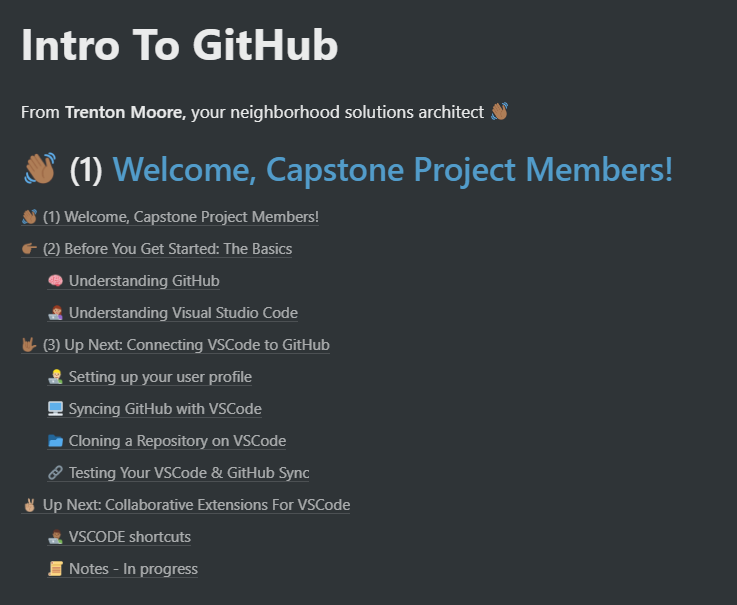

## About

GitHub is the Google Drive for developers. We'll store everything we need for the project here. Click the image under **shared resources** to get started!

## Tech Stack Resources & Walkthroughs

Use this to access walkthroughs or documentation

- **Django:** https://www.notion.so/trentonimoore/Django-0bf30cd2607a46b281af68ae3a6f61c4
- **Axios :** https://www.npmjs.com/package/axios
- **Authentication :** https://docs.djangoproject.com/en/3.1/topics/auth/
- **Heroku :** https://www.heroku.com/postgres

### Intro to GitHub and Visual Studio Walkthrough

There are four phases in the walkthrough thus far. Click the image below to access them all. When I add new phases, I will alert everyone.

## Links

- **ERD:** https://lucid.app/lucidchart/cb587084-defb-4ab4-96ab-adabfe6e5700/edit?shared=true&page=0_0#?folder_id=home&browser=icon
- **Roles:** https://docs.google.com/document/d/1aWmZIIXD664cktpzpXwQIx641yGpeTs1AgT1bxnicq8/edit
- **Wireframe/Framework:** https://www.figma.com/file/9QLVfP4C7bNXbUbde7IAun/Wireframes-ARTSOnepass?node-id=0%3A1

## GitHub Tips

- **Mastering Markdown:** https://guides.github.com/features/mastering-markdown/
